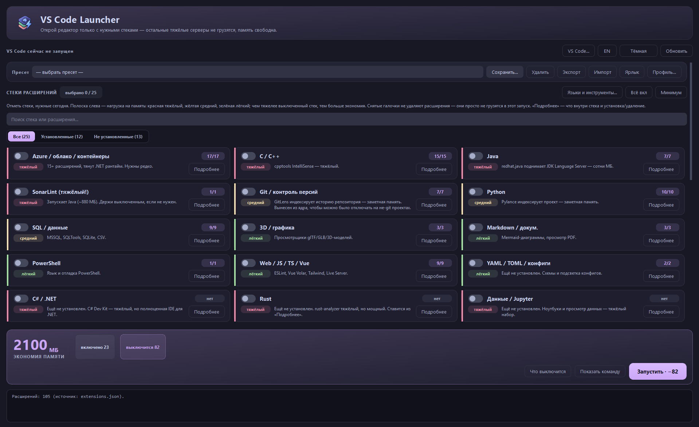
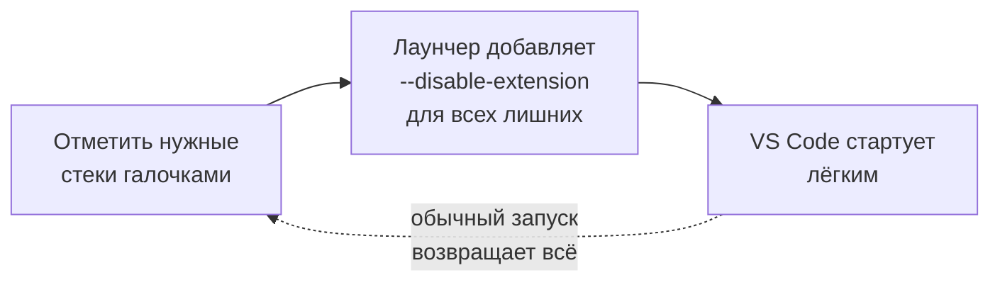
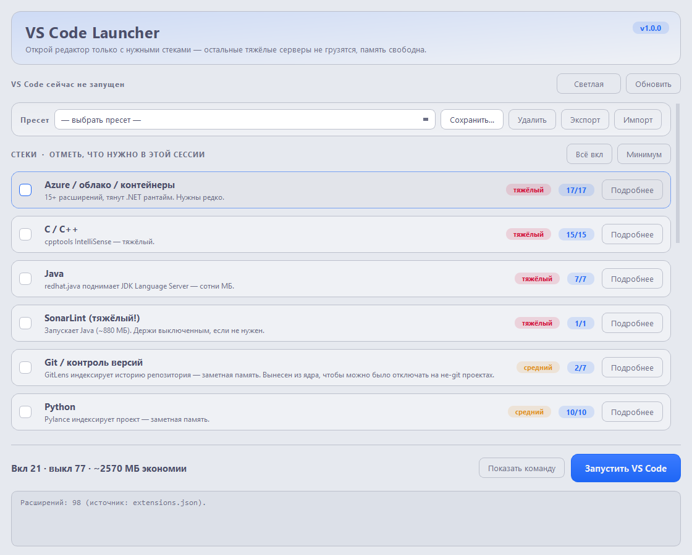

<div align="center">

# VS Code Launcher

**Запускает VS Code только с нужными в этой сессии стеками расширений — тяжёлые языковые серверы не грузятся, и память освобождается.**

Галочки по категориям → лаунчер добавляет `--disable-extension` для всего лишнего → редактор стартует лёгким. Эффект полностью обратим.




</div>

---

## Содержание

- [Зачем это нужно](#зачем-это-нужно)
- [Как это работает](#как-это-работает)
- [Требования](#требования)
- [Запуск](#запуск)
- [Возможности](#возможности)
- [Горячие клавиши](#горячие-клавиши)
- [Производительность самого лаунчера](#производительность-самого-лаунчера)
- [Категории](#категории)
- [Проверка логики без GUI](#проверка-логики-без-gui)
- [Сборка в один exe](#сборка-в-один-exe)
- [Запуск скачанного exe](#запуск-скачанного-exe)
- [Структура проекта](#структура-проекта)
- [Скриншоты](#скриншоты)
- [Безопасность](#безопасность)
- [Тесты](#тесты)
- [Лицензия](#лицензия)

---

## Зачем это нужно

VS Code при старте поднимает **все** установленные расширения сразу — а языковые серверы (C/C++, SonarLint, Java, десяток расширений Azure) едят память постоянно, даже если сегодня вы правите один Markdown-файл. Отключать их вручную через UI и включать обратно — долго и лень.

VS Code Launcher решает это иначе:

| | Всё включено (обычный запуск) | Ручное отключение в UI | VS Code Launcher |
|---|---|---|---|
| Память в простое | Максимум | Меньше | **Меньше, по одному клику** |
| Сколько действий | 0 | Много (искать, снимать галочки) | **Галочки по стекам + Enter** |
| Вернуть всё обратно | — | Столько же кликов вручную | **Обычный запуск VS Code** |
| Что-то удаляется из системы | Нет | Нет | **Нет, только флаги запуска** |
| Видно фактическую экономию | Нет | Нет | **Да, живой замер working set** |
| Настройка под свой набор | — | — | **Карта категорий в JSON** |

Сколько именно ОЗУ вы сэкономите, зависит от того, что установлено **у вас**: тул выключает только реально установленные расширения из невыбранных стеков. Для примера, на сборке автора (около 97 расширений) отключение тяжёлых стеков вроде SonarLint (около 880 МБ), C/C++ или полутора десятков расширений Azure освобождает порядка 1–1.5 ГБ.

---

## Как это работает



Ничего не удаляется и не правится в базе VS Code. Лаунчер просто запускает редактор с флагами `--disable-extension <id>` для всех расширений из **невыбранных** категорий. Обычный запуск VS Code (не через лаунчер) снова поднимает весь набор — эффект полностью обратим.

Поддерживаются и стабильная сборка, и **VS Code Insiders** (определяется автоматически; для Insiders корректно закрывается `Code - Insiders.exe`). Оценка экономии памяти считается только по реально установленным расширениям выключаемых стеков.

---

## Требования

- Windows 10/11
- Python 3.12+ (у автора — 3.14) с установленным PyQt6:
  ```
  pip install .
  ```
  (зависимости описаны в `pyproject.toml`; ставится PyQt6)
- Установленный VS Code с доступным CLI (`code` в PATH или стандартный путь). Для портативной или нестандартно установленной сборки путь к `code.cmd`/`Code.exe` можно задать вручную ключом `"code_cli"` в `launcher_config.json` (или флагом `--code-cli` в CLI-режиме) — лаунчер предпочтёт его автопоиску, если файл существует.

---

## Запуск

- Двойной клик по `scripts\Запустить.bat` (рекомендуется — стартует отдельным процессом, отвязанным от терминала).
- Или из консоли: `pythonw vscode_launcher.py`

> [!WARNING]
> Если включена галочка «Закрыть запущенный VS Code», не запускай лаунчер из встроенного терминала VS Code — он закроется вместе с редактором. Используй `scripts\Запустить.bat`.

---

## Возможности

- **Стеки расширений** — галочки по категориям из `data/categories.json`. В комплекте идёт готовая карта (Git, Python, C/C++, Java, Web, SQL, Azure, 3D, Markdown, PowerShell, SonarLint и другие) — это стартовый пример, который вы правите под свой набор. У каждого стека бейдж нагрузки (лёгкий / средний / тяжёлый) и кнопка «Подробнее»: список плагинов стека, что каждый делает и установлен ли он.
  <details>
  <summary>Управление расширениями прямо из окна «Подробнее»</summary>

  - «Установить» для отдельного плагина или «Установить недостающие» для всего стека — через `code --install-extension`;
  - «Удалить» для установленного — через `code --uninstall-extension`;
  - обе операции идут в фоне и запрашивают подтверждение (по умолчанию «Нет»);
  - при пакетной установке недостающих виден прогресс «Устанавливаю i/N…», полоска загрузки и кнопка «Отмена» (прерывает между расширениями — текущее доустановится, следующие нет); чёрное окно cmd при этом не выскакивает — консоль подпроцессов подавлена;
  - ошибки не сыплются попапами: по итогу пакетной операции одна сводка «установлено / ошибок / отменено» и список неудачных;
  - после операции статус строки, кнопки и счётчики на карточке обновляются сами.
  </details>
- **Языки и инструменты** — кнопка в шапке списка стеков открывает управление самими тулчейнами: компилятор C/C++ (MinGW-w64 + GDB + make, опционально CMake/Ninja/Clang), JDK, Go, Rust, .NET, Node.js, Ruby, Python, Git. Расширение VS Code для языка бесполезно без него — здесь недостающее ставится в пару кликов, а не гуглится по инструкциям.
  <details>
  <summary>Установка, PATH, обновление, удаление, настройка VS Code</summary>

  - установка/обновление/удаление идут через **winget** (входит в состав Windows 10/11) — он качает пакет из доверенного источника и проверяет подпись; свой загрузчик не изобретается, бинари в репозиторий не тащатся;
  - у каждого пакета виден статус (установлен, с версией / отсутствует) и что он **даёт** (у MinGW это gcc, g++, gdb, mingw32-make, gfortran); действия на пакет: **Установить / Проверить / Обновить / Удалить**, плюс «Установить всё» на тулчейн;
  - **«Проверить»** запускает инструмент и показывает его версию — подтверждает, что он реально работает, а не просто «числится»;
  - всё в фоне: прогресс «i/N…», полоска и «Отмена»; пока идёт операция, кнопки заблокированы (одна за раз); чёрное окно cmd подавлено; ошибки winget переводятся в понятный текст (нужен UAC, пакет не найден, отменено…);
  - **PATH прописывается автоматически.** Большинство пакетов winget делают это сами; для архивных сборок (MinGW-w64/WinLibs) лаунчер находит распакованный `bin` и дописывает его в **пользовательский** PATH через реестр `HKCU\Environment` — **без прав администратора и без `setx`** (тот молча обрезает PATH до 1024 символов), после чего рассылает `WM_SETTINGCHANGE`, чтобы новые терминалы подхватили изменение (учитывается и системный PATH, чтобы не задваивать);
  - **«Добавить в PATH»** — если компилятор уже стоит на диске (MSYS2, ручной MinGW на любом диске, LLVM, CMake), но не виден из терминала, лаунчер найдёт его и добавит в PATH без повторной загрузки;
  - **«Настроить VS Code»** (для C/C++) прописывает `C_Cpp.default.compilerPath` и разумные стандарты (`c17`/`c++20`) в `settings.json` — только недостающие ключи, с бэкапом, — чтобы IntelliSense и сборка заработали сразу;
  - ключи тулчейнов совпадают с ключами стеков (`cpp`, `java`, `go`…): при выборе папки проекта, где есть язык без установленного тулчейна, в окне всплывает подсказка **«Для этого проекта не хватает инструментов… Поставить»**, ведущая прямо к нужной карточке;
  - в командную строку winget уходит только id из встроенного каталога, проверенный строгим валидатором — пользовательский ввод в аргументы не попадает; все операции пишутся в `launcher.log`.
  </details>
- **Ядро** — стеки, помеченные в карте как «всегда включённые» (в поставке это косметика, продуктивность, орфография, русский язык — лёгкие расширения). Список правится в `data/categories.json`. Git-инструменты вынесены в отдельный стек, потому что GitLens заметно ест память, и на не-git проектах его удобно отключать.
- **Поиск по стекам** — строка над списком фильтрует карточки по названию, заметке и id расширений. На выбор галочек не влияет; при активном фильтре «Всё вкл» и «Минимум» действуют только на видимые стеки.
- **Автоопределение стеков по проекту** — при выборе папки лаунчер бегло сканирует её (маркеры вроде `requirements.txt`, `package.json`, `go.mod`, `Cargo.toml`, `Dockerfile`, `*.csproj` и расширения файлов) и предлагает включить подходящие стеки одной кнопкой. Дополнительно читает **рекомендации воркспейса** из `.vscode/extensions.json` (JSONC терпится) и мапит их id на стеки — если проект уже перечислил нужные расширения, лаунчер это подхватит. Предлагаются только стеки с реально установленными расширениями; тяжёлые каталоги (`node_modules`, `.venv` и т.п.) в обход не попадают.
- **Память стеков по папке** — какой набор стеков вы выбрали для проекта, лаунчер запоминает и предлагает его снова при следующем открытии этой же папки (путь нормализуется — регистр и слэши не важны). Ничего не навязывается: это та же строка-подсказка «Включить», что и у автодетекта.
- **Что выключится** — кнопка рядом с «Запустить» показывает точный список расширений, которые уйдут в `--disable-extension`, сгруппированный по стекам. Видно заранее, что именно отключится, — список можно скопировать.
- **Тонкая настройка по расширению** — в окне «Подробнее» у каждого плагина есть переключатель «по стеку / всегда вкл / всегда выкл». Можно, например, держать весь стек Python включённым, но выключить один тяжёлый плагин — оверрайды сохраняются в конфиге и перекрывают галочку стека.
- **Пресеты как лаунч-профили** — сохрани не только набор стеков, но и опции запуска (папка, закрыть VS Code, без GPU, голый режим, новое окно, профиль) и переключайся одним кликом. Старые пресеты-списки продолжают работать; при импорте/экспорте распознаются обе формы. Кнопка **«Ярлык»** делает `.cmd`-файл, который открывает VS Code с этим пресетом одним двойным кликом — без окна лаунчера (через тихий CLI-режим). Кнопки экспорта и импорта переносят пресеты в JSON между машинами (импорт объединяется с текущими).
- **Живой замер памяти** (сверху) — реальный working set всех процессов VS Code, а не оценка. Кнопка обновления пересчитывает; после запуска замер обновляется сам через несколько секунд, чтобы был виден фактический эффект. Замер запоминается для каждого набора стеков: при следующем таком же выборе в сводке появляется «замерено ранее: X МБ» — фактический footprint, а не только грубая оценка. Когда вы хоть раз запускали редактор **со всеми включёнными стеками**, лаунчер берёт это за базлайн и показывает **реально сэкономлено ~X МБ** (замер минус замер), а не только прикидку по весам.
- **Английский интерфейс** — переключатель RU/EN рядом с темой; выбор запоминается. Названия и заметки стеков берутся из твоего `categories.json` и остаются как есть.
- **Проверка обновлений** — при старте лаунчер ненавязчиво сверяет версию с последним релизом на GitHub (в фоне, ошибки сети игнорируются). Если вышла новая версия — сверху появляется баннер со ссылкой на страницу релизов. Отключается ключом `"check_updates": false` в `launcher_config.json`.
- **Папка проекта** — какой проект открыть (необязательно) плюс список недавних.
- **Закрыть VS Code перед стартом** — чтобы память реально освободилась. По умолчанию жёстко (быстро и надёжно). Галочка «Мягко» просит VS Code закрыться штатно (с запросом на сохранение) и ждёт, пока он выйдет, прежде чем стартовать новый, — несохранённое не теряется. Если оставить открытым диалог сохранения, запуск отменится.
- **Без GPU-ускорения** (`--disable-gpu`) — для слабых или глючных видеокарт.
- **Голый режим** (`--disable-extensions`) — отключает вообще все расширения, включая ядро. Максимальная скорость; галочки стеков при этом игнорируются.
- **Профиль** — открыть окно с конкретным профилем VS Code (`--profile <имя>`). Профиль нужно заранее создать в самом VS Code (Profiles) — наполнить профиль расширениями из CLI нельзя, лаунчер только переключает на готовый.
- **Показать команду** — превью того, что запустится.
- **Автонастройка `settings.json`** — добавляет рекомендованные настройки VS Code для установленных стеков (формат при сохранении и т.п.). Только **недостающие** ключи — существующие настройки не трогаются, перед записью делается **бэкап**. Можно просто скопировать настройки, не применяя. Рекомендации правятся в `data/recommended_settings.json`.
- **Тема** — переключатель светлой/тёмной темы (Catppuccin Latte / Mocha) вверху окна. Выбор запоминается; тёмная по умолчанию.
- **Цветные метки нагрузки** — полоска слева у карточки (красная/жёлтая/зелёная), чтобы сразу видеть тяжёлые стеки.
- **Адаптивная сетка стеков** — карточки раскладываются в 1–3 колонки по ширине окна (на широком мониторе меньше прокрутки, горизонталь не пустует). Вкл/выкл стека — переключатель-тумблер; активная карточка подсвечивается акцентом.
- **Панель экономии** внизу — крупным числом показывает сэкономленные МБ, рядом чипы «включено / выключится / замерено», а кнопка запуска отражает, сколько расширений уйдёт в `--disable` (`Запустить · −N`). Ключевая ценность видна с одного взгляда.
- **Доступность** — видимые рамки фокуса при навигации с клавиатуры (Tab), счётчик результатов поиска («показано N из M»), чип «выбрано N / M» в шапке.
- Окно **запоминает размер и позицию** между запусками.

### Горячие клавиши

- <kbd>Enter</kbd> — запустить VS Code с текущим выбором.
- <kbd>Esc</kbd> — закрыть лаунчер.

---

## Производительность самого лаунчера

Список установленных расширений читается напрямую из `%USERPROFILE%\.vscode\extensions\extensions.json` (около 1 мс) вместо запуска `code --list-extensions` (около 0.5 с со спавном Node). Список грузится в фоновом потоке (окно не подмерзает) и кэшируется в `launcher_config.json`, поэтому последующие запуски показывают стеки мгновенно. Медленный CLI остаётся надёжным запасным вариантом (портативные сборки, WSL, нестандартная папка расширений).

---

## Категории

Карта «расширение — категория» лежит в `data/categories.json`. В комплекте идёт готовая карта, составленная под набор расширений автора (около 97 штук) — это стартовая точка, а не жёсткая часть программы.

> [!TIP]
> **Правьте карту под себя:** добавляйте свои расширения в нужные категории, лишнее удаляйте. Что не попало в карту, лаунчер оставит включённым — это безопасный дефолт.

Тул работает только с тем, что реально установлено у вас:

- Расширения из карты, которых у вас нет, показываются с пометкой «нет» — галочка такого стека ни на что не влияет.
- Всё, чего нет в карте, считается неизвестным и остаётся включённым (безопасное поведение по умолчанию), пока вы не добавите его в категорию. Что не попало в карту, видно в окне по кнопке «Не в карте».

В карте есть и готовые сборки, которых у вас может не быть в системе: Go, Rust, Docker/Kubernetes, Данные/Jupyter, Удалённая разработка (SSH/WSL), REST/API, YAML/TOML, C#/.NET, PHP, Ruby, Lua, Terraform, Svelte/Astro, GraphQL. Для отсутствующих откройте «Подробнее» → «Установить недостающие», чтобы поставить весь стек из маркетплейса.

### Стеки в комплекте

Цвет бейджа — ориентировочная нагрузка на память при включении. Чем тяжелее стек, тем больше вы выигрываете, держа его выключенным.

| Нагрузка | Стеки |
|---|---|
|  | SonarLint, Java, Azure / облако / контейнеры, C / C++, Rust, Данные / Jupyter, C# / .NET |
|  | Python, SQL / данные, Git, Go, Docker / Kubernetes, PHP, Ruby, Terraform / IaC |
|  | Web / JS / TS / Vue, 3D / графика, Markdown, PowerShell, Удалённая разработка, REST / API, YAML / TOML, Lua, Svelte / Astro, GraphQL |
|  | Косметика, продуктивность, орфография, русский язык — лёгкие, грузятся всегда |

---

## Проверка логики без GUI

```
python vscode_launcher.py --selftest python,web
```

Покажет, что будет включено и выключено, неизвестные расширения и итоговую команду.

### Запуск из командной строки (без окна)

Для ярлыков, скриптов и планировщика есть тихий CLI-режим — открывает VS Code с нужным набором стеков, не поднимая GUI (и не требуя PyQt6):

```
python vscode_launcher.py --run --stacks python,git --folder D:\proj
python vscode_launcher.py --run --preset web           # набор + опции из пресета-профиля
python vscode_launcher.py --stacks python,git          # dry-run: только показать команду
python vscode_launcher.py --stacks python,git --json   # то же, но машиночитаемо
python vscode_launcher.py --list-stacks                # доступные стеки: ключ, нагрузка, установлено
python vscode_launcher.py --list-presets               # показать сохранённые пресеты
python vscode_launcher.py --make-shortcut web.cmd --preset web   # .cmd-ярлык для пресета
python vscode_launcher.py --list-toolchains             # тулчейны: что доступно и что уже стоит
python vscode_launcher.py --toolchain-status            # сводный статус по всем (без ключа)
python vscode_launcher.py --toolchain-status cpp        # подробный статус тулчейна (версии, что даёт)
python vscode_launcher.py --install-toolchain cpp       # поставить компилятор C/C++ и прописать PATH
python vscode_launcher.py --install-toolchain cpp --include-optional   # + CMake/Ninja/Clang
python vscode_launcher.py --upgrade-toolchain cpp       # обновить установленное (winget upgrade)
python vscode_launcher.py --uninstall-toolchain cpp     # удалить и очистить PATH
python vscode_launcher.py --add-existing cpp            # компилятор уже на диске (MSYS2/MinGW) → в PATH
python vscode_launcher.py --configure-vscode cpp        # прописать компилятор в settings.json VS Code
```

Установка тулчейнов идёт через **winget** и, где нужно, сама дописывает PATH (см. раздел «Языки и инструменты»). Коды возврата: `0` — успех/делать нечего; `2` — неизвестный ключ или нет winget; `3` — часть пакетов не обработалась. Все команды принимают `--json` для скриптов.

Без `--run` это dry-run: печатается итоговая команда и сколько расширений выключится, ничего не запуская. Полезные флаги: `--kill` (закрыть VS Code перед стартом), `--profile ИМЯ`, `--gpu-off`, `--bare`, `--no-new-window`, `--code-cli ПУТЬ` (портативная/нестандартная сборка), `--json` (для скриптов), `--quiet` (без пояснений). Если `--preset` указывает на пресет-профиль, его опции (папка/kill/gpu/bare/…) применяются, но явные флаги CLI имеют приоритет. Персональные оверрайды по расширениям из окна тоже учитываются.

**Коды возврата:** `0` — успех/dry-run; `2` — ошибка использования (нет CLI VS Code, неизвестный пресет для ярлыка); `3` — процесс VS Code не удалось запустить. Удобно для ветвления в скриптах и планировщике.

---

## Сборка в один exe

Чтобы раздать лаунчер без установки Python и PyQt6, собери одиночный exe (PyInstaller):

- Двойной клик по `scripts\Собрать_exe.bat`, или вручную:
  ```
  pip install .[dev]
  pyinstaller packaging/VSCodeLauncher.spec --noconfirm
  ```

Готовый файл появится в `dist\VSCodeLauncher.exe`. Данные (`data/`, `assets/`) упакованы внутрь; личный `launcher_config.json` создаётся рядом с exe. Иконка exe — `assets/app.ico`, а свойства файла (версия, описание, автор) берутся из `packaging/version_info.txt` (оба задаются в `packaging/VSCodeLauncher.spec`). UPX-сжатие намеренно выключено, чтобы снизить ложные срабатывания антивирусов.

---

## Запуск скачанного exe

> [!IMPORTANT]
> SmartScreen и антивирус реагируют на **любой незнакомый им неподписанный exe**, а не на обнаруженную угрозу. Это не значит, что в файле что-то есть.

Лаунчер не подписан цифровым сертификатом (подпись платная), поэтому при первом запуске Windows может показать одно из двух окон:

- **SmartScreen «Windows защитила ваш компьютер».** Нажмите «Подробнее» и затем «Всё равно выполнить». Так Windows реагирует на любой незнакомый ей exe, а не на обнаруженную угрозу.
- **Антивирус.** Неподписанные однофайловые сборки PyInstaller иногда дают ложные срабатывания. Если файл попал на карантин — добавьте исключение или соберите exe сами из исходников (раздел «Сборка в один exe»), это полностью повторяемо.

Проверить, что скачанный файл не повреждён и совпадает с релизом:

```
certutil -hashfile VSCodeLauncher.exe SHA256
```

Сверьте вывод с суммой из файла `VSCodeLauncher.exe.sha256`, приложенного к релизу на GitHub.

---

## Структура проекта

<details>
<summary>Показать дерево файлов</summary>

```
VSCodeLauncher/
  vscode_launcher.py       точка входа (GUI / --selftest / CLI)
  pyproject.toml           метаданные, зависимости, конфиг pytest
  launcher/                код приложения (обзор — в launcher/__init__.py)
    __init__.py            версия пакета
    paths.py               пути, ROOT/CONFIG_DIR, файлы данных и лога
    safety.py              валидация id расширений, экранирование аргументов
    config.py              загрузка/сохранение конфига, логирование
    categories.py          карта стеков, дубли, веса, рекомендации
    detect.py              автоопределение стеков по содержимому папки
    vscode.py              CLI VS Code: чтение/установка расширений, kill/launch
    toolchains.py          установка тулчейнов (компиляторы, SDK) через winget
    env_path.py            запись пользовательского PATH через реестр (без setx)
    launch.py              сборка команды запуска, оценка экономии ОЗУ
    presets.py             пресеты-профили (стеки + опции) и генератор .cmd-ярлыка
    settings_apply.py      автонастройка settings.json + ротация бэкапов
    selftest.py            CLI-прогон логики без GUI
    cli.py                 тихий режим запуска без GUI (ярлыки, скрипты)
    updates.py             проверка обновлений
    i18n.py                строки интерфейса
    theme.py               палитры Catppuccin Mocha/Latte, генератор QSS, тайтлбар
    gui_widgets.py         CategoryCard и фабрики виджетов
    gui_workers.py         фоновые QThread (загрузка/память/установка)
    gui.py                 окно PyQt6 (карточки, пресеты, диалоги), run_gui
    core.py                фасад для обратной совместимости (реэкспорт)
  data/
    categories.json        карта расширений по категориям (правь под себя)
    plugin_descriptions.json   id — описание для окна «Подробнее»
    recommended_settings.json  рекомендованные настройки по стекам (автонастройка)
  assets/
    app.ico                иконка окна и exe
    logo.png               логотип в шапке
  scripts/
    Запустить.bat          запуск отдельным процессом
    Собрать_exe.bat        сборка exe через PyInstaller
  packaging/
    VSCodeLauncher.spec    конфиг сборки PyInstaller
    version_info.txt       свойства exe (версия, описание, автор)
  docs/
    screenshot-dark.png    скриншоты для README
    screenshot-light.png
  tests/
    test_core.py           тесты чистой логики (pytest)
  LICENSE
  README.md
```

</details>

Личный конфиг `launcher_config.json` и `launcher.log` создаются сами рядом с приложением и в репозиторий не попадают.

---

## Скриншоты

<table>
<tr>
<td width="50%"><br><div align="center"><sub>Тёмная тема — Catppuccin Mocha</sub></div></td>
<td width="50%"><br><div align="center"><sub>Светлая тема — Catppuccin Latte</sub></div></td>
</tr>
</table>

---

## Безопасность

- **Запуск без оболочки.** VS Code запускается напрямую через `Code.exe` списком аргументов (`CreateProcess`), минуя `cmd.exe` — оболочка вообще не разбирает строку, поэтому классических shell-инъекций нет. `taskkill` тоже вызывается списком с фиксированными аргументами. Запасной путь через `cmd /c` включается только если `Code.exe` не найден (портативная сборка) — и тоже списком, а не единой строкой.
- **Валидация id расширений.** Перед добавлением в аргументы запуска каждый id проверяется по шаблону `publisher.name` — подменённый `categories.json`/`extensions.json` не протащит инъекцию. Невалидные id молча пропускаются, установка/удаление их отклоняют.
- **Санитайзинг пути и профиля.** Из пути к проекту и имени профиля вырезаются символы для вырывания из кавычек `cmd` и подстановки переменных окружения (`"`, `%`, перевод строки), а также срезаются ведущие дефисы — чтобы путь или профиль вроде `--disable-workspace-trust` не был воспринят `Code.exe` как флаг CLI (argument injection). Несуществующий путь к папке лаунчер не откроет без подтверждения.
- **Автонастройка не разрушает данные.** Записывает только недостающие ключи, делает бэкап `settings.json` и отказывается трогать файл с JSONC-синтаксисом (комментарии/хвостовые запятые), чтобы его не сломать.
- **Установка тулчейнов безопасна.** В командную строку `winget` уходит только id из встроенного каталога, проверенный строгим валидатором (`^[A-Za-z0-9][A-Za-z0-9.+_-]*$`) — пользовательский ввод в аргументы не попадает. PATH правится через реестр `HKCU\Environment` (пользовательская ветка, без прав администратора), а **не** через `setx`, который молча обрезает PATH до 1024 символов; существующие записи сохраняются, дубли не добавляются.
- **Ничего не уходит наружу.** Тул работает только с локальным CLI VS Code; установка/удаление и полный запуск редактора всегда спрашивают подтверждение.

---

## Тесты

```
pip install .[dev]
python -m pytest
```

Покрывают чистую логику из `launcher/core.py` (карта категорий, расчёт выключаемых расширений, оценка памяти, сборка команды, устойчивость к битому `categories.json`).

---

## Лицензия

MIT — см. файл [LICENSE](LICENSE).
