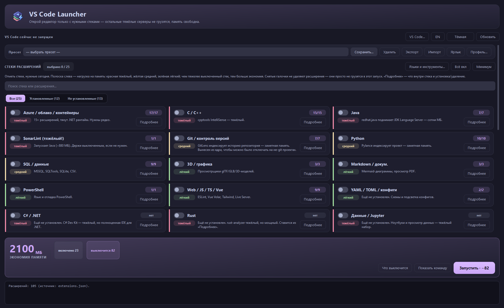
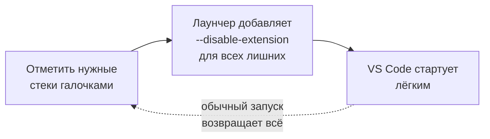
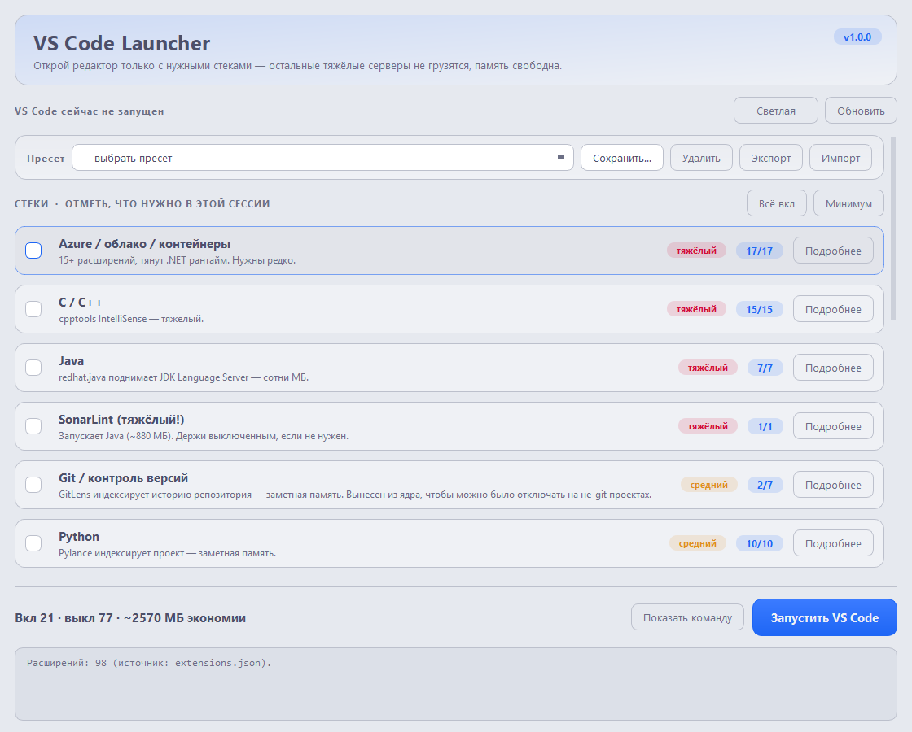
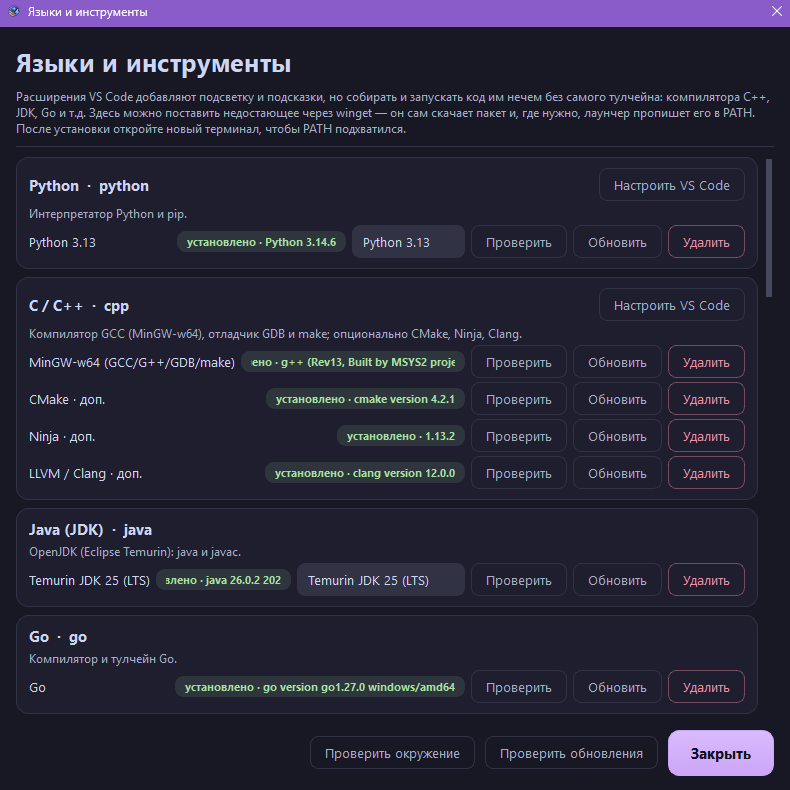
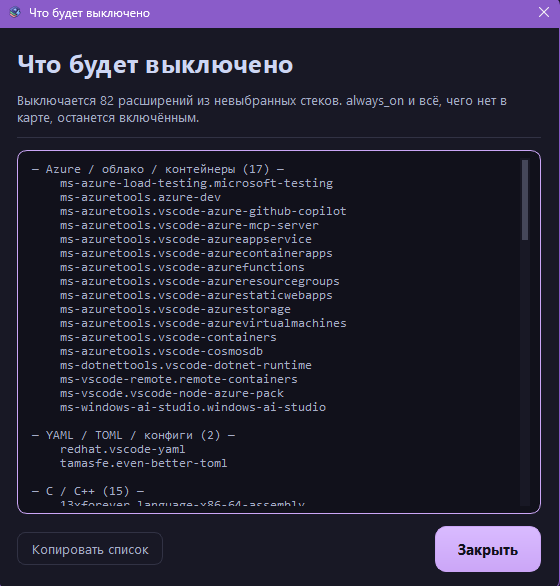

<div align="center">

# VS Code Launcher

**Запускает VS Code только с нужными в этой сессии стеками расширений — тяжёлые языковые серверы не грузятся, и память освобождается.**

Галочки по категориям → лаунчер добавляет `--disable-extension` для всего лишнего → редактор стартует лёгким. Эффект полностью обратим.


[](https://github.com/moonlivedt-oss/VSCLwMoon/actions/workflows/ci.yml)

История изменений — в [CHANGELOG.md](CHANGELOG.md).



</div>

---

## Содержание

- [Зачем это нужно](#зачем-это-нужно)
- [Как это работает](#как-это-работает)
- [Требования](#требования)
- [Запуск](#запуск)
- [Возможности](#возможности)
- [Горячие клавиши](#горячие-клавиши)
- [C++: установка и настройка](#c-установка-и-настройка)
- [Производительность самого лаунчера](#производительность-самого-лаунчера)
- [Категории](#категории)
- [Проверка логики без GUI](#проверка-логики-без-gui)
- [Сборка в один exe](#сборка-в-один-exe)
- [Запуск скачанного exe](#запуск-скачанного-exe)
- [Структура проекта](#структура-проекта)
- [Скриншоты](#скриншоты)
- [Безопасность](#безопасность)
- [Тесты](#тесты)
- [Лицензия](#лицензия)

---

## Зачем это нужно

VS Code при старте поднимает **все** установленные расширения сразу — а языковые серверы (C/C++, SonarLint, Java, десяток расширений Azure) едят память постоянно, даже если сегодня вы правите один Markdown-файл. Отключать их вручную через UI и включать обратно — долго и лень.

VS Code Launcher решает это иначе:

| | Всё включено (обычный запуск) | Ручное отключение в UI | VS Code Launcher |
|---|---|---|---|
| Память в простое | Максимум | Меньше | **Меньше, по одному клику** |
| Сколько действий | 0 | Много (искать, снимать галочки) | **Галочки по стекам + Enter** |
| Вернуть всё обратно | — | Столько же кликов вручную | **Обычный запуск VS Code** |
| Что-то удаляется из системы | Нет | Нет | **Нет, только флаги запуска** |
| Видно фактическую экономию | Нет | Нет | **Да, живой замер working set** |
| Настройка под свой набор | — | — | **Карта категорий в JSON** |

Сколько именно ОЗУ вы сэкономите, зависит от того, что установлено **у вас**: тул выключает только реально установленные расширения из невыбранных стеков. Для примера, на сборке автора (около 97 расширений) отключение тяжёлых стеков вроде SonarLint (около 880 МБ), C/C++ или полутора десятков расширений Azure освобождает порядка 1–1.5 ГБ.

---

## Как это работает


```mermaid
flowchart LR
    A["Отметить нужные<br/>стеки галочками"] --> B["Лаунчер добавляет<br/>--disable-extension<br/>для всех лишних"]
    B --> C["VS Code стартует<br/>лёгким"]
    C -.->|"обычный запуск<br/>возвращает всё"| A
```

Ничего не удаляется и не правится в базе VS Code. Лаунчер просто запускает редактор с флагами `--disable-extension <id>` для всех расширений из **невыбранных** категорий. Обычный запуск VS Code (не через лаунчер) снова поднимает весь набор — эффект полностью обратим.

Поддерживаются и стабильная сборка, и **VS Code Insiders** (определяется автоматически; для Insiders корректно закрывается `Code - Insiders.exe`). Оценка экономии памяти считается только по реально установленным расширениям выключаемых стеков.

---

## Требования

- Windows 10/11
- Python 3.12+ (у автора — 3.14) с установленным PyQt6:
  ```
  pip install .
  ```
  (зависимости описаны в `pyproject.toml`; ставится PyQt6)
- Установленный VS Code с доступным CLI (`code` в PATH или стандартный путь). Для портативной или нестандартно установленной сборки путь к `code.cmd`/`Code.exe` можно задать вручную ключом `"code_cli"` в `launcher_config.json` (или флагом `--code-cli` в CLI-режиме) — лаунчер предпочтёт его автопоиску, если файл существует.

---

## Запуск

- Двойной клик по `scripts\Запустить.bat` (рекомендуется — стартует отдельным процессом, отвязанным от терминала).
- Или из консоли: `pythonw vscode_launcher.py`

> [!WARNING]
> Если включена галочка «Закрыть запущенный VS Code», не запускай лаунчер из встроенного терминала VS Code — он закроется вместе с редактором. Используй `scripts\Запустить.bat`.

---

## Возможности

Окно устроено как панели vscode-bg и cpp-docs-panel: слева навигация по разделам,
справа страница. **Запуск** — папка проекта, пресет, стеки и баннер с экономией и
кнопкой запуска. **C / C++** — установка, проверка и настройка проекта. **Языки** —
компиляторы и SDK через winget. **Расширения** — замер памяти, незнакомые
расширения, исключения, автонастройка settings.json. **Обслуживание** — уборка,
проверка PATH, журнал. **Настройки** — тема, палитра (9 наборов с пейзажами),
язык, параметры запуска и трей. Редкие действия спрятаны в меню «···».


- **Стеки расширений** — галочки по категориям из `data/categories.json`. В комплекте идёт готовая карта (Git, Python, C/C++, Java, Web, SQL, Azure, 3D, Markdown, PowerShell, SonarLint и другие) — это стартовый пример, который вы правите под свой набор. У каждого стека бейдж нагрузки (лёгкий / средний / тяжёлый) и кнопка «Подробнее»: список плагинов стека, что каждый делает и установлен ли он.
  <details>
  <summary>Управление расширениями прямо из окна «Подробнее»</summary>

  - «Установить» для отдельного плагина или «Установить недостающие» для всего стека — через `code --install-extension`;
  - «Удалить» для установленного — через `code --uninstall-extension`;
  - обе операции идут в фоне и запрашивают подтверждение (по умолчанию «Нет»);
  - при пакетной установке недостающих виден прогресс «Устанавливаю i/N…», полоска загрузки и кнопка «Отмена» (прерывает между расширениями — текущее доустановится, следующие нет); чёрное окно cmd при этом не выскакивает — консоль подпроцессов подавлена;
  - ошибки не сыплются попапами: по итогу пакетной операции одна сводка «установлено / ошибок / отменено» и список неудачных;
  - после операции статус строки, кнопки и счётчики на карточке обновляются сами.
  </details>
- **Языки и инструменты** — кнопка в шапке списка стеков открывает управление самими тулчейнами: компилятор C/C++ (MinGW-w64 + GDB + make, опционально CMake/Ninja/Clang), JDK, Go, Rust, .NET, Node.js, Ruby, Python, PHP, Lua, Deno, Bun, Zig, Dart, Julia, Swift, Git. Расширение VS Code для языка бесполезно без него — здесь недостающее ставится в пару кликов, а не гуглится по инструкциям.
  <details>
  <summary>Установка, PATH, обновление, удаление, настройка VS Code</summary>

  - установка/обновление/удаление идут через **winget** (входит в состав Windows 10/11) — он качает пакет из доверенного источника и проверяет подпись; свой загрузчик не изобретается, бинари в репозиторий не тащатся;
  - у каждого пакета виден статус (установлен, с версией / отсутствует) и что он **даёт** (у MinGW это gcc, g++, gdb, mingw32-make, gfortran); действия на пакет: **Установить / Проверить / Обновить / Удалить**, плюс «Установить всё» на тулчейн;
  - **«Проверить»** запускает инструмент и показывает его версию — подтверждает, что он реально работает, а не просто «числится»;
  - всё в фоне: прогресс «i/N…», полоска и «Отмена»; пока идёт операция, кнопки заблокированы (одна за раз); чёрное окно cmd подавлено; ошибки winget переводятся в понятный текст (нужен UAC, пакет не найден, отменено…);
  - **PATH прописывается автоматически.** Большинство пакетов winget делают это сами; для архивных сборок (MinGW-w64/WinLibs) лаунчер находит распакованный `bin` и дописывает его в **пользовательский** PATH через реестр `HKCU\Environment` — **без прав администратора и без `setx`** (тот молча обрезает PATH до 1024 символов), после чего рассылает `WM_SETTINGCHANGE`, чтобы новые терминалы подхватили изменение (учитывается и системный PATH, чтобы не задваивать);
  - **«Добавить в PATH»** — если компилятор уже стоит на диске (MSYS2, ручной MinGW на любом диске, LLVM, CMake), но не виден из терминала, лаунчер найдёт его и добавит в PATH без повторной загрузки;
  - **«Настроить VS Code»** прописывает путь к тулчейну в `settings.json` (только недостающие ключи, с бэкапом): для C/C++ — `C_Cpp.default.compilerPath` и разумные стандарты (`c17`/`c++20`); для Python — `python.defaultInterpreterPath` (чтобы не выбирать интерпретатор вручную на первом запуске);
  - **«Проверить окружение»** (доктор) показывает установленные тулчейны с версиями, здоровье PATH **раздельно для пользовательского и системного** (дубли, мёртвые записи, длина) и `JAVA_HOME` — и тут же чинит: **«Почистить свой PATH»** убирает дубли и несуществующие каталоги из пользовательской ветки (без прав администратора), **«Почистить системный PATH»** — из машинной (поднимает UAC; если лаунчер уже elevated — пишет напрямую). Обе чистки не удаляют резервные каталоги тулчейнов (`go\bin`, `.dotnet\tools`, а также любые `path_hints` из каталога) и делают бэкап в файл рядом с конфигом. **«Исправить JAVA_HOME»** находит установленный JDK, прописывает переменную и, если JDK не на PATH, дописывает его `bin`. После установки JDK `JAVA_HOME` выставляется автоматически;
  - детект «неполной» установки: у пакета можно задать команду-подтверждение (`verify_cmd`) — например, `.NET` считается установленным только если `dotnet --list-sdks` реально выдаёт SDK, а не когда в PATH просто есть мультиплексор рантайма без SDK;
  - ключи тулчейнов совпадают с ключами стеков (`cpp`, `java`, `go`…): при выборе папки проекта, где есть язык без установленного тулчейна, в окне всплывает подсказка **«Для этого проекта не хватает инструментов… Поставить»**, ведущая прямо к нужной карточке;
  - в командную строку winget уходит только id из встроенного каталога, проверенный строгим валидатором — пользовательский ввод в аргументы не попадает; все операции пишутся в `launcher.log`.
  </details>
- **Ядро** — стеки, помеченные в карте как «всегда включённые» (в поставке это тема, иконки, Claude, закладки, ErrorLens, русский язык — лёгкие расширения). Список правится в `data/categories.json`. Всё, что стартует вместе с редактором и нужно не везде, вынесено в свои стеки: **Орфография** (Code Spell Checker — отдельный языковой сервер), **Оформление** (анимации, Custom CSS), **Code Runner**. Тяжёлые стеки разделены на лёгкую и тяжёлую части: **Git (лёгкий)** и **GitLens / GitHub**, **SQLite / CSV** и **SQL Server / SQLTools**, **Azure** и **Azure AI / MCP**. Старые пресеты и выборы при обновлении дописываются так, чтобы включать то же, что раньше (кроме орфографии и Code Runner — их вынос и есть экономия).
- **Поиск по стекам** — строка над списком фильтрует карточки по названию, заметке и id расширений. На выбор галочек не влияет; при активном фильтре «Всё вкл» и «Минимум» действуют только на видимые стеки.
- **Автоопределение стеков по проекту** — при выборе папки лаунчер бегло сканирует её (маркеры вроде `requirements.txt`, `package.json`, `go.mod`, `Cargo.toml`, `Dockerfile`, `*.csproj` и расширения файлов) и предлагает включить подходящие стеки одной кнопкой. Дополнительно читает **рекомендации воркспейса** из `.vscode/extensions.json` (JSONC терпится) и мапит их id на стеки — если проект уже перечислил нужные расширения, лаунчер это подхватит. Предлагаются только стеки с реально установленными расширениями; тяжёлые каталоги (`node_modules`, `.venv` и т.п.) в обход не попадают.
- **Память стеков по папке** — какой набор стеков вы выбрали для проекта, лаунчер запоминает и предлагает его снова при следующем открытии этой же папки (путь нормализуется — регистр и слэши не важны). Ничего не навязывается: это та же строка-подсказка «Включить», что и у автодетекта.
- **Что выключится** — кнопка рядом с «Запустить» показывает точный список расширений, которые уйдут в `--disable-extension`, сгруппированный по стекам. Видно заранее, что именно отключится, — список можно скопировать.
- **Тонкая настройка по расширению** — в окне «Подробнее» у каждого плагина есть переключатель «по стеку / всегда вкл / всегда выкл». Можно, например, держать весь стек Python включённым, но выключить один тяжёлый плагин — оверрайды сохраняются в конфиге и перекрывают галочку стека.
- **Пресеты как лаунч-профили** — сохрани не только набор стеков, но и опции запуска (папка, закрыть VS Code, без GPU, голый режим, новое окно, профиль) и переключайся одним кликом. Старые пресеты-списки продолжают работать; при импорте/экспорте распознаются обе формы. Кнопка **«Ярлык»** делает `.cmd`-файл, который открывает VS Code с этим пресетом одним двойным кликом — без окна лаунчера (через тихий CLI-режим). Кнопки экспорта и импорта переносят пресеты в JSON между машинами (импорт объединяется с текущими).
- **Живой замер памяти** (сверху) — реальная **приватная** память всех процессов VS Code, а не оценка. Считается нативно через Win32 (`CreateToolhelp32Snapshot` + `GetProcessMemoryInfo`) — это единицы миллисекунд вместо секунды-двух на запуск `powershell.exe`, и работает там, где PowerShell урезан. Приватная память (private commit) не считает общие страницы движка по десять раз, поэтому число не раздувается от количества процессов. Кнопка обновления пересчитывает; после запуска замер обновляется сам через несколько секунд, чтобы был виден фактический эффект. Замер запоминается для каждого набора стеков: при следующем таком же выборе в сводке появляется «замерено ранее: X МБ» — фактический footprint, а не только грубая оценка. Когда вы хоть раз запускали редактор **со всеми включёнными стеками**, лаунчер берёт это за базлайн и показывает **реально сэкономлено ~X МБ** (замер минус замер), а не только прикидку по весам.
- **Значок в трее** — правый клик по значку даёт список пресетов: выбрал — VS Code открылся нужным набором, окно поднимать не надо. Пункт «Показать окно» возвращает лаунчер, «Выход» закрывает совсем. Отдельная галочка «Крестик сворачивает в трей» оставляет лаунчер под рукой вместо закрытия. Отключается галочкой «Значок в трее» (применяется после перезапуска).
- **Один экземпляр** — второй запуск не поднимает второе окно, а будит уже открытое (через `QLocalServer`). Со значком в трее это обязательно: иначе два окна спорили бы за один конфиг, и настройки сохранял бы тот, кто закрылся последним.
- **Перетаскивание проекта** — папку или файл `.code-workspace` можно просто бросить в окно; обычный файл понимается как «открыть его папку». Рядом с «Обзор…» появилась кнопка **«Рабочая область…»** для многопапочных проектов — раньше указать `.code-workspace` было нельзя, диалог пускал только каталоги.
- **Реальный вес стека** — на карточке рядом с меткой нагрузки виден **размер установленных расширений стека на диске** (`тяжёлый · 865 МБ`). Это не оценка, а байты: сразу видно, какие стеки дорогие, ещё до первого запуска редактора. Обход папки расширений идёт в фоне и кэшируется.
- **Калибровка по своим замерам** — если два прошлых запуска отличались ровно одним стеком, разница их footprint'ов и есть цена этого стека **на твоей машине**. Лаунчер считает её по истории замеров (медиана, чтобы один шумный замер не задавал число) и использует вместо таблицы «тяжёлый/средний/лёгкий». Подсказка у числа экономии честно говорит, сколько стеков посчитано по замерам, а сколько по таблице.
- **«Замерить расширения»** — показывает, **какой стек сколько держит в памяти прямо сейчас**. Лаунчер обходит дерево процессов VS Code и относит каждый процесс к расширению по пути в командной строке: `cpptools.exe` — к C/C++, `java.exe` SonarLint — к SonarLint, сервер Pylance — к Python. Дополнительно спрашивает сам VS Code (`code --status`). Оболочки терминала и то, что в них запущено, в замер не входят. Тот же обход теперь используется и в живом замере памяти: языковые серверы — отдельные процессы, и раньше их память в «экономию» не попадала.
- **Уборка** — кнопка «Уборка…» находит, что VS Code накопил на диске и сам не чистит: копии установщиков расширений (`CachedExtensionVSIXs`), данные проектов, папок которых уже нет (`workspaceStorage`), кэши движка, логи прошлых сеансов, старые версии расширений рядом с установленной новой. Список с галочками и размерами, удаление — **в Корзину** и только при закрытом VS Code. Версии без зарегистрированной новой (ручные сборки, свои плагины в разработке) не трогаются.
- **Метка «стартует сразу»** — в окне «Подробнее» у расширений, которые активируются при каждом запуске редактора (`*` или `onStartupFinished`), а не по языку или команде. Именно их выгоднее всего выключать стеком.
- **Исключения по расширениям в одном месте** — счётчик рядом с картой открывает список всех личных «всегда включать / всегда выключать» с кнопкой «Убрать». Раньше исключение ставилось в «Подробнее» нужного стека и там же терялось из виду, хотя оно сильнее галочки.
- **Английский интерфейс** — переключатель RU/EN рядом с темой; выбор запоминается. Смена языка пересобирает окно, **не теряя несохранённого**: галочки, папка, поиск, фильтр и позиция прокрутки переезжают в новое окно. Названия и заметки стеков берутся из твоего `categories.json` и остаются как есть.
- **Проверка обновлений** — при старте лаунчер ненавязчиво сверяет версию с последним релизом на GitHub (в фоне, ошибки сети игнорируются). Если вышла новая версия — сверху появляется баннер со ссылкой на страницу релизов. Отключается ключом `"check_updates": false` в `launcher_config.json`.
- **Папка проекта** — какой проект открыть (необязательно) плюс список недавних.
- **Закрыть VS Code перед стартом** — чтобы память реально освободилась. По умолчанию жёстко (быстро и надёжно). Галочка «Мягко» просит VS Code закрыться штатно (с запросом на сохранение) и ждёт, пока он выйдет, прежде чем стартовать новый, — несохранённое не теряется. Если оставить открытым диалог сохранения, запуск отменится.
- **Без GPU-ускорения** (`--disable-gpu`) — для слабых или глючных видеокарт.
- **Голый режим** (`--disable-extensions`) — отключает вообще все расширения, включая ядро. Максимальная скорость; галочки стеков при этом игнорируются.
- **Профиль** — открыть окно с конкретным профилем VS Code (`--profile <имя>`). Профиль нужно заранее создать в самом VS Code (Profiles) — наполнить профиль расширениями из CLI нельзя, лаунчер только переключает на готовый.
- **Показать команду** — превью того, что запустится.
- **Автонастройка `settings.json`** — добавляет рекомендованные настройки VS Code: общие против фоновой нагрузки (без автоскачивания типов TypeScript, без автопоиска задач npm, без экспериментов, восстановление одного окна) и по установленным стекам (лимиты памяти IntelliSense C++ и JVM Java, без CodeLens GitLens, формат при сохранении и т.п.). В предпросмотре — только **недостающие** ключи, существующие настройки не трогаются, перед записью делается **бэкап**. `settings.json` с комментариями поддерживается: новые ключи вставляются текстом, комментарии и порядок остаются. Рекомендации правятся в `data/recommended_settings.json`.
- **Тема** — переключатель светлой/тёмной темы (Catppuccin Latte / Mocha) вверху окна. Выбор запоминается; тёмная по умолчанию.
- **Цветные метки нагрузки** — полоска слева у карточки (красная/жёлтая/зелёная), чтобы сразу видеть тяжёлые стеки.
- **Адаптивная сетка стеков** — карточки раскладываются в 1–3 колонки по ширине окна (на широком мониторе меньше прокрутки, горизонталь не пустует). Вкл/выкл стека — переключатель-тумблер; активная карточка подсвечивается акцентом.
- **Панель экономии** внизу — крупным числом показывает сэкономленные МБ, рядом чипы «включено / выключится / замерено», а кнопка запуска отражает, сколько расширений уйдёт в `--disable` (`Запустить · −N`). Ключевая ценность видна с одного взгляда.
- **Доступность** — видимые рамки фокуса при навигации с клавиатуры (Tab), счётчик результатов поиска («показано N из M»), чип «выбрано N / M» в шапке.
- **Конфиг не теряется** — известные ключи проверяются по типу при загрузке: битое значение сбрасывается в одиночку, а не роняет весь файл (одна кривая правка руками не стирает пресеты). Нечитаемый `launcher_config.json` не затирается молча, а откладывается рядом как `launcher_config.corrupt-<время>.json`. Если папка рядом с exe недоступна на запись (Program Files, сетевой диск, флешка), конфиг и лог уезжают в `%LOCALAPPDATA%\VSCodeLauncher`, а старый конфиг переносится туда один раз.
- Окно **запоминает размер и позицию** между запусками.

### C++: установка и настройка

Кнопка **«C++…»** над стеками открывает C++-центр: всё для C/C++ в одном окне, с тремя вкладками.

- **Установка.** Компоненты сгруппированы по тому, за что отвечают: компилятор (MinGW, MSYS2, MSVC Build Tools или уже установленный), сборка (CMake + CMake Tools, Ninja), подсказки кода (cpptools или clangd), отладка (GDB, CodeLLDB), анализ и пакеты (cppcheck, ccache, Doxygen, vcpkg, Conan), библиотеки через pacman (SFML, SDL2, raylib, fmt, Boost, GoogleTest, Qt…) и настройка (прописать компилятор в VS Code, сделать его первым в PATH). У каждого пункта — строка «за что отвечает» и статус «уже есть / нет». Три готовых набора: «Учёба и олимпиады», «Проекты на CMake», «Лёгкий и современный». Внизу — сколько будет установлено, сколько весит и нужны ли права администратора; одна кнопка ставит всё по порядку с прогрессом по шагам. Зависимости добавляются сами: clangd ставит или обновляет LLVM, vcpkg — git, MSYS2 сразу приносит GCC, CMake, Ninja и GDB.
- **Проверка.** Доктор C++: находит все компиляторы (PATH, MSYS2 на любом диске, MSVC через vswhere), ловит смесь тулчейнов в PATH (чужая `libstdc++-6.dll` — «точка входа не найдена»), gdb не от того GCC, устаревшие Clang/clangd/CMake, Clang без MSVC. Пробная сборка C++20 проверяет компиляцию, линковку, запуск и отладчик. У проблем — кнопки исправления: «Навести порядок в PATH» (основной GCC вперёд, остальные в конец или прочь, с предпросмотром и бэкапом) и «Подобрать установку».
- **Проект.** Генерирует под выбранный компилятор `.vscode/tasks.json` (Ctrl+Shift+B), `launch.json` (F5, отладчик в паре с компилятором), `c_cpp_properties.json` или `.clangd`, `CMakePresets.json`, `.clang-format`, `.clang-tidy`. Существующие файлы без галочки не трогаются, перезаписываемые сохраняются в `.bak`. В режиме clangd IntelliSense cpptools отключается только в этом проекте. Шаблоны нового проекта: один файл, олимпиадная задача (сборка `-O2` и запуск на `input.txt`), CMake, CMake + vcpkg.

Стек C++ разбит на части, чтобы грузить только нужное: база, IntelliSense cpptools, IntelliSense clangd, CMake, Makefile, CodeLLDB, дополнительно. cpptools и clangd помечены как конфликтующие — лаунчер предупредит, если включить оба. Автоопределение по папке выбирает части сам (CMake или Makefile, `.clangd`, SFML/GoogleTest в `#include`) и предлагает настроить C++-проект без `.vscode`.

### Горячие клавиши

- <kbd>Enter</kbd> — запустить VS Code с текущим выбором.
- <kbd>Esc</kbd> — закрыть лаунчер.

---

## Производительность самого лаунчера

Список установленных расширений читается напрямую из `%USERPROFILE%\.vscode\extensions\extensions.json` (около 1 мс) вместо запуска `code --list-extensions` (около 0.5 с со спавном Node). Список грузится в фоновом потоке (окно не подмерзает) и кэшируется в `launcher_config.json`, поэтому последующие запуски показывают стеки мгновенно. Медленный CLI остаётся надёжным запасным вариантом (портативные сборки, WSL, нестандартная папка расширений).

---

## Категории

Карта «расширение — категория» лежит в `data/categories.json`. В комплекте идёт готовая карта, составленная под набор расширений автора (около 97 штук) — это стартовая точка, а не жёсткая часть программы.

> [!TIP]
> **Правьте карту под себя:** добавляйте свои расширения в нужные категории, лишнее удаляйте. Что не попало в карту, лаунчер оставит включённым — это безопасный дефолт.

Тул работает только с тем, что реально установлено у вас:

- Расширения из карты, которых у вас нет, показываются с пометкой «нет» — галочка такого стека ни на что не влияет.
- Всё, чего нет в карте, считается неизвестным и остаётся включённым (безопасное поведение по умолчанию), пока вы не добавите его в категорию. Что не попало в карту, видно в окне по кнопке «Не в карте».

В карте есть и готовые сборки, которых у вас может не быть в системе: Go, Rust, Docker/Kubernetes, Данные/Jupyter, Удалённая разработка (SSH/WSL), REST/API, YAML/TOML, C#/.NET, PHP, Ruby, Lua, Terraform, Svelte/Astro, GraphQL. Для отсутствующих откройте «Подробнее» → «Установить недостающие», чтобы поставить весь стек из маркетплейса.

### Стеки в комплекте

Цвет бейджа — ориентировочная нагрузка на память при включении. Чем тяжелее стек, тем больше вы выигрываете, держа его выключенным.

| Нагрузка | Стеки |
|---|---|
|  | SonarLint, Java, Azure / облако / контейнеры, C++: IntelliSense cpptools, Rust, Данные / Jupyter, C# / .NET |
|  | Python, C++: clangd / CMake / Makefile, SQL / данные, Git, Go, Docker / Kubernetes, PHP, Ruby, Terraform / IaC |
|  | C / C++: база, CodeLLDB, дополнительно, Web / JS / TS / Vue, 3D / графика, Markdown, PowerShell, Удалённая разработка, REST / API, YAML / TOML, Lua, Svelte / Astro, GraphQL |
|  | Косметика, продуктивность, орфография, русский язык — лёгкие, грузятся всегда |

---

## Проверка логики без GUI

```
python vscode_launcher.py --selftest python,web
```

Покажет, что будет включено и выключено, неизвестные расширения и итоговую команду.

### Запуск из командной строки (без окна)

Для ярлыков, скриптов и планировщика есть тихий CLI-режим — открывает VS Code с нужным набором стеков, не поднимая GUI (и не требуя PyQt6):

```
python vscode_launcher.py --run --stacks python,git --folder D:\proj
python vscode_launcher.py --run --preset web           # набор + опции из пресета-профиля
python vscode_launcher.py --stacks python,git          # dry-run: только показать команду
python vscode_launcher.py --stacks python,git --json   # то же, но машиночитаемо
python vscode_launcher.py --list-stacks                # доступные стеки: ключ, нагрузка, установлено
python vscode_launcher.py --stack-sizes                # сколько МБ на диске занимает каждый стек
python vscode_launcher.py --measure-extensions         # сколько памяти держит каждый стек и сам редактор
python vscode_launcher.py --cleanup                    # что VS Code накопил на диске (предпросмотр)
python vscode_launcher.py --cleanup --yes              # переместить это в Корзину (VS Code должен быть закрыт)
python vscode_launcher.py --version                    # версия лаунчера
python vscode_launcher.py --list-presets               # показать сохранённые пресеты
python vscode_launcher.py --make-shortcut web.cmd --preset web   # .cmd-ярлык для пресета
python vscode_launcher.py --list-toolchains             # тулчейны: что доступно и что уже стоит
python vscode_launcher.py --toolchain-status            # сводный статус по всем (без ключа)
python vscode_launcher.py --toolchain-status cpp        # подробный статус тулчейна (версии, что даёт)
python vscode_launcher.py --install-toolchain cpp       # поставить компилятор C/C++ и прописать PATH
python vscode_launcher.py --install-toolchain cpp --include-optional   # + CMake/Ninja/Clang
python vscode_launcher.py --upgrade-toolchain cpp       # обновить установленное (winget upgrade)
python vscode_launcher.py --uninstall-toolchain cpp     # удалить и очистить PATH
python vscode_launcher.py --add-existing cpp            # компилятор уже на диске (MSYS2/MinGW) → в PATH
python vscode_launcher.py --configure-vscode cpp        # компилятор C++ → settings.json VS Code
python vscode_launcher.py --configure-vscode python     # интерпретатор Python → settings.json VS Code
python vscode_launcher.py --doctor                      # окружение: тулчейны, здоровье PATH, JAVA_HOME
python vscode_launcher.py --clean-path                  # предпросмотр: дубли и мёртвые записи в вашем PATH
python vscode_launcher.py --clean-path --yes            # применить чистку пользовательского PATH (с бэкапом)
python vscode_launcher.py --clean-path --machine --yes  # чистить СИСТЕМНЫЙ PATH (нужен админ; поднимется UAC)
python vscode_launcher.py --clean-path --yes --keep-dead # убрать только дубли, мёртвые записи оставить
python vscode_launcher.py --fix-java-home               # найти установленный JDK и прописать JAVA_HOME
python vscode_launcher.py --path-doctor [--yes] [--all] # умная починка PATH: конфликты, мёртвые, дубли
python vscode_launcher.py --path-undo [N] [--yes]       # список бэкапов PATH / откат к N-му
python vscode_launcher.py --cpp-doctor                  # доктор C++: компиляторы, смесь в PATH, пробная сборка
python vscode_launcher.py --cpp-fix-path D:\msys64\ucrt64\bin [--remove] [--yes]  # основной GCC в PATH
python vscode_launcher.py --cpp-setup D:\proj --engine clangd --build cmake  # .vscode под компилятор
python vscode_launcher.py --cpp-new D:\code\hello --template olympiad       # новый проект из шаблона
python vscode_launcher.py --msys2 sfml,fmt              # GCC/CMake/Ninja/gdb и библиотеки через pacman
python vscode_launcher.py --install-vcpkg               # клон и сборка vcpkg, VCPKG_ROOT и PATH
```

Установка тулчейнов идёт через **winget** и, где нужно, сама дописывает PATH (см. раздел «Языки и инструменты»). Коды возврата: `0` — успех/делать нечего; `2` — неизвестный ключ или нет winget; `3` — часть пакетов не обработалась. Все команды принимают `--json` для скриптов.

Без `--run` это dry-run: печатается итоговая команда и сколько расширений выключится, ничего не запуская. Полезные флаги: `--kill` (закрыть VS Code перед стартом), `--profile ИМЯ`, `--gpu-off`, `--bare`, `--no-new-window`, `--code-cli ПУТЬ` (портативная/нестандартная сборка), `--json` (для скриптов), `--quiet` (без пояснений). Если `--preset` указывает на пресет-профиль, его опции (папка/kill/gpu/bare/…) применяются, но явные флаги CLI имеют приоритет. Персональные оверрайды по расширениям из окна тоже учитываются.

**Коды возврата:** `0` — успех/dry-run; `2` — ошибка использования (нет CLI VS Code, неизвестный пресет для ярлыка); `3` — процесс VS Code не удалось запустить. Удобно для ветвления в скриптах и планировщике.

---

## Сборка в один exe

Чтобы раздать лаунчер без установки Python и PyQt6, собери одиночный exe (PyInstaller):

- Двойной клик по `scripts\Собрать_exe.bat`, или вручную:
  ```
  pip install .[dev]
  pyinstaller packaging/VSCodeLauncher.spec --noconfirm
  ```

Готовый файл появится в `dist\VSCodeLauncher.exe`. Данные (`data/`, `assets/`) упакованы внутрь; личный `launcher_config.json` создаётся рядом с exe. Иконка exe — `assets/app.ico`, а свойства файла (версия, описание, автор) берутся из `packaging/version_info.txt` (оба задаются в `packaging/VSCodeLauncher.spec`). UPX-сжатие намеренно выключено, чтобы снизить ложные срабатывания антивирусов.

---

## Запуск скачанного exe

> [!IMPORTANT]
> SmartScreen и антивирус реагируют на **любой незнакомый им неподписанный exe**, а не на обнаруженную угрозу. Это не значит, что в файле что-то есть.

Лаунчер не подписан цифровым сертификатом (подпись платная), поэтому при первом запуске Windows может показать одно из двух окон:

- **SmartScreen «Windows защитила ваш компьютер».** Нажмите «Подробнее» и затем «Всё равно выполнить». Так Windows реагирует на любой незнакомый ей exe, а не на обнаруженную угрозу.
- **Антивирус.** Неподписанные однофайловые сборки PyInstaller иногда дают ложные срабатывания. Если файл попал на карантин — добавьте исключение или соберите exe сами из исходников (раздел «Сборка в один exe»), это полностью повторяемо.

Проверить, что скачанный файл не повреждён и совпадает с релизом:

```
certutil -hashfile VSCodeLauncher.exe SHA256
```

Сверьте вывод с суммой из файла `VSCodeLauncher.exe.sha256`, приложенного к релизу на GitHub.

---

## Структура проекта

<details>
<summary>Показать дерево файлов</summary>

```
VSCodeLauncher/
  vscode_launcher.py       точка входа (GUI / --selftest / CLI)
  pyproject.toml           метаданные, зависимости, конфиг pytest
  launcher/                код приложения (обзор — в launcher/__init__.py)
    __init__.py            версия пакета
    paths.py               пути, ROOT/CONFIG_DIR, файлы данных и лога
    safety.py              валидация id расширений, экранирование аргументов
    config.py              загрузка/сохранение конфига, логирование
    categories.py          карта стеков, дубли, веса, рекомендации
    detect.py              автоопределение стеков по содержимому папки
    vscode.py              CLI VS Code: чтение/установка расширений, kill/launch, разбор --status
    winmem.py              нативный (ctypes) замер памяти процессов Windows
    weights.py             реальный вес стеков: размер на диске + калибровка по замерам
    toolchains.py          установка тулчейнов (компиляторы, SDK) через winget
    path_doctor.py         умная починка PATH: анализ обеих веток, затенение, предпросмотр, откат
    cpp.py                 доктор C++: компиляторы, смесь в PATH, пробная сборка, MSYS2, vcpkg
    cpp_setup.py           C++-центр без GUI: компоненты по ролям, план и выполнение установки
    cpp_project.py         генерация .vscode/CMakePresets под компилятор, шаблоны проектов
    cli_cpp.py             C++-команды CLI (--cpp-doctor, --cpp-setup, ...)
    env_path.py            запись пользовательского PATH через реестр (без setx)
    launch.py              сборка команды запуска, что выключить
    quicklaunch.py         запуск пресета одной функцией (окно, CLI и трей)
    presets.py             пресеты-профили (стеки + опции) и генератор .cmd-ярлыка
    settings_apply.py      автонастройка settings.json + ротация бэкапов
    selftest.py            CLI-прогон логики без GUI
    cli.py                 тихий режим запуска без GUI (ярлыки, скрипты)
    updates.py             проверка обновлений
    i18n.py                строки интерфейса
    theme.py               палитры Catppuccin Mocha/Latte, генератор QSS, тайтлбар
    gui_widgets.py         CategoryCard и фабрики виджетов
    gui_workers.py         фоновые QThread (загрузка/память/размеры/установка)
    gui_tray.py            значок в трее: пресеты без открытия окна
    gui_path.py            окно «Починка PATH»
    gui_cpp.py             окно C++-центра (установка, проверка, проект)
    gui_shell.py           оболочка окна: навигация, секции, плитки, баннер, палитры
    gui.py                 окно PyQt6 (карточки, пресеты, диалоги), run_gui
    core.py                фасад для обратной совместимости (реэкспорт)
  data/
    categories.json        карта расширений по категориям (правь под себя)
    plugin_descriptions.json   id — описание для окна «Подробнее»
    recommended_settings.json  рекомендованные настройки по стекам (автонастройка)
  assets/
    app.ico                иконка окна и exe
    logo.png               логотип в шапке
    mascots/               талисман C++-центра (из cpp-docs-panel)
    icons/                 иконки разделов навигации (из vscode-bg и cpp-docs-panel)
    palettes/              пейзажи палитр для баннера и превью (из cpp-docs-panel)
  scripts/
    Запустить.bat          запуск отдельным процессом
    Собрать_exe.bat        сборка exe через PyInstaller
  packaging/
    VSCodeLauncher.spec    конфиг сборки PyInstaller
    version_info.txt       свойства exe (версия, описание, автор)
  docs/
    screenshot-dark.png    скриншоты для README (тёмная/светлая)
    screenshot-light.png
    toolchains.png         диалог «Языки и инструменты»
    what-disables.png      диалог «Что выключится»
  tests/
    test_core.py           тесты чистой логики (pytest)
    test_v14.py            нативный замер, разбор --status, вес стеков, пути конфига
    test_i18n.py           переводы: плейсхолдеры, полнота, ни одной русской строки мимо _()
  LICENSE
  README.md
```

</details>

Личный конфиг `launcher_config.json` и `launcher.log` создаются сами рядом с приложением (а если туда нельзя писать — в `%LOCALAPPDATA%\VSCodeLauncher`) и в репозиторий не попадают.

---

## Скриншоты

<table>
<tr>
<td width="50%"><br><div align="center"><sub>Тёмная тема — сетка стеков и панель экономии памяти</sub></div></td>
<td width="50%"><br><div align="center"><sub>Светлая тема — тот же экран</sub></div></td>
</tr>
<tr>
<td width="50%"><br><div align="center"><sub>«Языки и инструменты» — установка тулчейнов и правка PATH через winget</sub></div></td>
<td width="50%"><br><div align="center"><sub>«Что выключится» — точный список отключаемых расширений</sub></div></td>
</tr>
</table>

---

## Безопасность

- **Запуск без оболочки.** VS Code запускается напрямую через `Code.exe` списком аргументов (`CreateProcess`), минуя `cmd.exe` — оболочка вообще не разбирает строку, поэтому классических shell-инъекций нет. `taskkill` тоже вызывается списком с фиксированными аргументами. Запасной путь через `cmd /c` включается только если `Code.exe` не найден (портативная сборка) — и тоже списком, а не единой строкой.
- **Валидация id расширений.** Перед добавлением в аргументы запуска каждый id проверяется по шаблону `publisher.name` — подменённый `categories.json`/`extensions.json` не протащит инъекцию. Невалидные id молча пропускаются, установка/удаление их отклоняют.
- **Санитайзинг пути и профиля.** Из пути к проекту и имени профиля вырезаются символы для вырывания из кавычек `cmd` и подстановки переменных окружения (`"`, `%`, перевод строки), а также срезаются ведущие дефисы — чтобы путь или профиль вроде `--disable-workspace-trust` не был воспринят `Code.exe` как флаг CLI (argument injection). Несуществующий путь к папке лаунчер не откроет без подтверждения.
- **Автонастройка не разрушает данные.** Записывает только недостающие ключи и делает бэкап `settings.json`. В файл с комментариями ключи вставляются текстом; результат перепроверяется разбором, и если что-то не сходится, файл не трогается.
- **Установка тулчейнов безопасна.** В командную строку `winget` уходит только id из встроенного каталога, проверенный строгим валидатором (`^[A-Za-z0-9][A-Za-z0-9.+_-]*$`) — пользовательский ввод в аргументы не попадает. PATH правится через реестр `HKCU\Environment` (пользовательская ветка, без прав администратора), а **не** через `setx`, который молча обрезает PATH до 1024 символов; существующие записи сохраняются, дубли не добавляются.
- **Ничего не уходит наружу.** Тул работает только с локальным CLI VS Code; установка/удаление и полный запуск редактора всегда спрашивают подтверждение.

---

## Тесты

```
pip install .[dev]
python -m pytest
```

Покрывают чистую логику из `launcher/core.py` (карта категорий, расчёт выключаемых расширений, оценка памяти, сборка команды, устойчивость к битому `categories.json`), разбор вывода `code --status`, калибровку веса стеков по замерам, выбор папки конфига и полноту переводов. Плюс smoke-тесты окна на offscreen-платформе Qt — они ловят падения сборки интерфейса без живого дисплея.

---

## Лицензия

MIT — см. файл [LICENSE](LICENSE).
